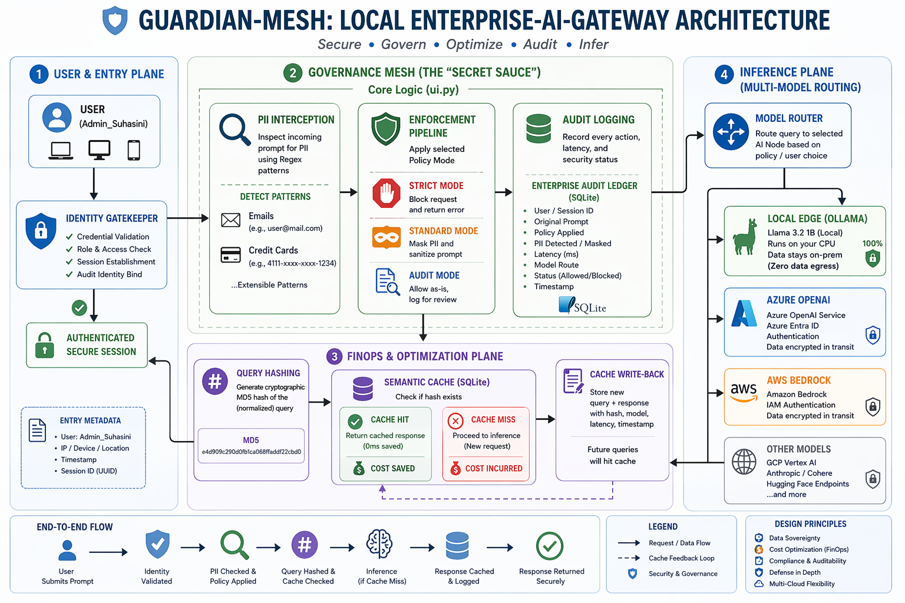
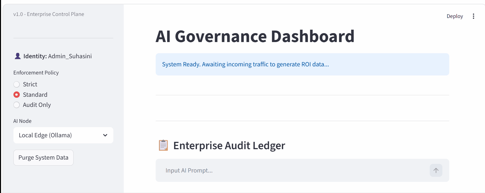

# 🛡️ Guardian-Mesh: Enterprise AI Governance Layer
Secure • Govern • Observe • Optimize GenAI Systems at Scale

**Guardian-Mesh** is a high-performance control plane designed to bridge the gap between AI innovation and enterprise security. It sits between your users and LLMs (Azure, AWS, GCP) to enforce safety, optimize costs, and provide visibility.

---

## Problem

Enterprise adoption of Generative AI introduces critical risks:

* Uncontrolled LLM access and prompt misuse
* Sensitive data exposure (PII, credentials)
* Lack of auditability for compliance (GDPR, HIPAA)
* Escalating LLM inference costs
* No visibility into AI system behavior

Most implementations focus on RAG and features, but lack a governance layer for production systems.

---
## Solution

Guardian-Mesh is an Enterprise AI Governance Control Plane that sits between users and LLMs (Azure, AWS, GCP, local models) to:

* Intercept and validate AI requests
* Enforce policy and security controls
* Optimize cost through intelligent routing and caching
* Provide observability into AI interactions
* Enable audit and compliance tracking

---
## Architecture Diagram

---
## Request Flow:
User → Identity Layer → Governance Mesh → Policy Engine → Model Router → LLM → Response Validator → Audit Ledger

---

## Live Demo
See the compliance audit in action:
Demonstrates:

Governance enforcement
Audit logging
Cost optimization via caching

---

##  Core Capabilities

## 1. Governance & Policy Enforcement
* Centralized request interception layer
* Policy-driven allow / block / route decisions
* Role-based AI access control
* Extensible policy framework (OPA-style design)

## 1. Prompt Firewall (Security Layer)
* Local PII detection and masking (emails, credentials)
* Prompt injection / jailbreak protection
* Input sanitization before LLM calls
* Data sovereignty enforcement (pre-cloud filtering)

## 3. Cost Optimization (FinOps for AI)
* Semantic caching to eliminate redundant API calls
* Token usage tracking and cost visibility
* Dynamic model routing (high-cost → low-cost fallback)
* Budget-aware inference strategies

## 4. Observability & Monitoring
* Prompt and response logging
* End-to-end request tracing
* Latency and failure monitoring
* Pattern detection for anomalies / hallucinations

## 5. Audit & Compliance Layer
* Identity-aware request tracking
* Full audit trail of AI interactions
* Compliance-ready logs (GDPR / HIPAA aligned design)
* Model usage and decision traceability

## 6. Multi-Cloud & Multi-Model Orchestration
* Unified gateway for:
* Azure OpenAI
* AWS Bedrock (extensible)
* GCP Vertex AI (extensible)
* Local models via Ollama
* Intelligent routing based on:
* cost
* latency
* policy constraints

---

##  Key Pillars
* ** Data Sovereignty:** Local PII scrubbing (emails, credentials) before cloud transmission.
* ** FinOps Intelligence:** Semantic caching to eliminate redundant LLM API costs.
* ** Compliance Ledger:** Identity-aware auditing for regulatory alignment (GDPR/HIPAA).
* ** Multi-Cloud Ready:** Unified gateway for Azure OpenAI, AWS Bedrock, and local models.

---
##  The Tech Stack
* Frontend: Streamlit (Executive Dashboard)
* Backend: Python (modular governance layer)
* Storage: SQLite (audit logs + semantic cache)
* Inference: Ollama (local edge) + Cloud LLM APIs
* Architecture Style: Control Plane + Agentic Workflow

---
## Production Design Considerations

Guardian-Mesh is designed with enterprise-scale patterns:

* Modular governance layer for extensibility
* Separation of control plane and inference layer
* Designed for high-volume request orchestration
* Supports integration with enterprise identity systems (extensible to Azure Entra ID)

---
## Business Impact

This system enables organizations to:

 * Secure GenAI usage before model execution
 * Prevent sensitive data leakage
 * Achieve compliance readiness with audit trails
 * Reduce LLM costs via caching and routing
 * Gain real-time visibility into AI system behavior

---
##  Quick Start
1. Clone the repo.
2. `pip install -r requirements.txt`
3. `streamlit run ui.py`

---
*Note:

This is an architectural MVP / prototype demonstrating core governance capabilities.

Planned enterprise extensions include:

* Azure Entra ID integration
* Advanced NER models for PII detection
* Policy-as-code engine integration
* Distributed logging and monitoring

 please contact me via  LinkedIn.https://www.linkedin.com/in/suhasini-k-1159353ba/
